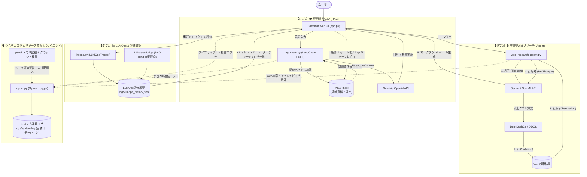

# 専門領域特化型Q&Aボット（RAG） & 自律型Webリサーチ & LLMOps・システム監視 仕様・説明書

講義資料（半導体工学・電磁気学など）やPDF論文を読み込ませて高精度に対話する「専門領域特化型Q&Aボット（RAG）」に、Web上の最新動向を自律的に調査・分析して体系的レポートを作成する「自律型Webリサーチ＆レポート自動生成エージェント」、実行トレーサビリティとRAG品質を定量評価する「LLMOpsダッシュボード」、および本番運用を見据えた「システムログ＆リソース監視基盤」を統合した包括的AIシステムです。

---

## 1. プロジェクト概要・目的

### 目的

- **専門知識の即時検索・解説（ローカルRAG）**: 半導体工学や電磁気学などの数式・専門用語が多い講義スライドやPDF論文を読み込ませ、疑問点に対して正確に回答。
- **最新動向の自律リサーチ＆レポート作成（Webエージェント）**: ユーザーが指定したテーマに対して自律的にWeb検索・情報収集を行い（ReActサイクル）、体系的なMarkdownレポートを生成。
- **ナレッジ連携（相乗効果）**: Webリサーチで生成されたレポートをワンクリックでナレッジベースに取り込み、即座にQ&A対話の対象にすることが可能。
- **LLMの可視化と評価（LLMOps）**: 応答レイテンシ、トークン消費、推定コスト、RAG Triad（接地性・忠実性、回答適合性、検索適合性）によるLLM-as-a-Judge自動採点、ユーザーフィードバック（👍/👎）の追跡。
- **堅牢なシステムログ＆リソース監視**: アプリ起動・停止、外部API通信エラー、ファイル破損・読み込み失敗、メモリ不足（OOM）や未捕捉例外によるクラッシュをファイルへ自動記録・ローテーション管理。

---

## 2. システムアーキテクチャ & 技術スタック



### 技術スタック一覧

| レイヤー                 | 技術 / ツール                                         | 役割                                                                                      |
| :----------------------- | :---------------------------------------------------- | :---------------------------------------------------------------------------------------- |
| **フロントエンド (UI)**  | **Streamlit** (`app.py`)                              | 3タブ統合UI（Q&Aチャット ⇄ Webリサーチ ⇄ LLMOpsダッシュボード）、PDFビューワー            |
| **LLM (生成AI)**         | **Google Gemini** / **OpenAI API**                    | 専門Q&A回答生成、エージェント思考・再思考、構造化レポート作成、LLM-as-a-Judge評価         |
| **LLMOps・品質評価**     | **LLMOpsTracker / RAGQualityJudge** (`llmops.py`)     | レイテンシ/トークン/コスト追跡、RAG Triad自動採点、フィードバック収集、ベンチマークテスト |
| **システムログ・監視**   | **RotatingFileHandler / psutil** (`logger.py`)        | 起動・停止、APIエラー、ファイル読込失敗、メモリ監視、未処理例外・クラッシュ追跡、機密マスク |
| **データ可視化**         | **Plotly** (`plotly.express`, `plotly.graph_objects`) | 時系列推移グラフ、RAG Triad レーダーチャート                                              |
| **自律エージェント**     | **WebResearchAgent** (`web_research_agent.py`)        | ReActサイクル（思考・検索・観察・再評価）、自律ループ制御                                 |
| **Web検索ツール**        | **DDGS / DuckDuckGo Search**                          | リアルタイムWeb検索、タイトル・スニペット・URLの抽出                                      |
| **AI連携フレームワーク** | **LangChain** (`rag_chain.py`)                        | LCELによるRetriever・プロンプト・LLMの統合チェーン                                        |
| **ベクトルデータベース** | **FAISS** (`vector_store.py`)                         | テキストベクトルの高速な類似度検索（L2距離 / コサイン類似度）                             |
| **ドキュメント処理**     | **PyPDFLoader / TextLoader** (`document_loader.py`)   | PDF・マークダウン・テキストの読み込みと日本語対応チャンク分割                             |

---

## 3. ディレクトリ構成

```text
Q＆Aボット(RAG)/
├── app.py                     # Streamlit Webアプリケーション (3タブUI統合)
├── logger.py                  # システムログ管理 & メモリ監視 & クラッシュ追跡モジュール
├── llmops.py                  # LLMOps・品質評価・ロギング・メトリクス集計
├── web_research_agent.py      # 自律型Webリサーチ＆レポート生成エージェント
├── rag_chain.py               # RAGチェーンロジック (LangChain LCEL & モデルフォールバック)
├── vector_store.py            # ベクトル化 & FAISSインデックス管理
├── document_loader.py         # 資料読み込み & チャンク分割
├── config.py                  # 環境変数 & APIキー設定管理
├── requirements.txt           # 依存ライブラリ一覧 (psutil含む)
├── .env                       # APIキー設定ファイル (秘匿)
├── .env.example               # APIキー設定テンプレート
├── .gitignore                 # Git管理除外設定
├── README.md                  # 仕様・説明書
├── web-research.md            # Webリサーチ仕様書
├── llmops_specification.md    # LLMOps仕様・設計書
├── data/                      # 講義資料・論文・リサーチレポート格納ディレクトリ
├── logs/                      # ログディレクトリ
│   ├── system.log             # システム運用ログ (最大5MB×5世代 自動ローテーション)
│   ├── llmops_history.json    # LLMOps実行・品質評価履歴ログ (JSON形式)
│   └── .app_status.json       # プロセス生存・クラッシュ検知用ステータスファイル
└── faiss_index/               # ベクトルストア保存先 (インデックスファイル)
```

---

## 4. ログ仕様とシステム運用監視

本システムでは、実運用環境における安定性・障害耐性・コスト管理を両立するため、用途に合わせて **2系統のログ** を分離して管理しています。

### ① システムログ (`logs/system.log`)

アプリケーションのインフラ・プロセス・運用層を監視するファイルログです。

#### 💡 なぜログローテーション（肥大化対策）を導入したのか？（運用視点の理由）
1. **ディスク枯渇（Disk Full）によるサーバー停止・クラッシュの防止**:
   - 長期間の常時稼働や多数のユーザーによる連続アクセスが発生した場合、単一ログファイルに追記し続けると数百MB〜数GBに無制限に肥大化し、サーバーのストレージを圧迫してシステム全体が停止する危険があります。
2. **I/O負荷の軽減とファイル破損リスクの排除**:
   - 巨大化したログファイルへの頻繁なI/O書き込みはディスク負荷やメモリ消費を増大させます。また、万が一のファイル破損時にも過去ログ全体が失われるのを防ぎます。
3. **障害調査（トラブルシューティング）の迅速化**:
   - 1ファイル最大 **5MB** × 最大 **5世代**（`system.log.1`〜`system.log.5`、合計最大約25〜30MB）に制限することで、調査対象のログサイズを適正に保ち、ログエディタでの閲覧や検索を極めて高速・容易にします。

#### 監視・記録項目一覧
- **プロセス・ライフサイクル**: 起動時刻、プロセスID (PID)、Pythonバージョン、メモリ使用量、正常終了 (Graceful Shutdown) を記録。
- **外部API通信エラー**: OpenAI / Gemini / DuckDuckGo のレート制限 (429 Too Many Requests)、タイムアウト、認証エラー、およびモデルフォールバックの試行を記録。
- **ファイルI/O・解析エラー**: 破損PDF、未対応フォーマット、文字コード不正、存在しないファイル指定、FAISSインデックス読み書き例外を記録。
- **リソース・クラッシュ監視**:
  - `psutil` によるメモリ使用率監視（RAM使用率85%超で警告、95%超でクリティカルログ出力）。
  - `sys.excepthook` による未捕捉例外のスタックトレース自動保存。
  - プロセス不正終了（OOM Killerや強制終了）の次回起動時検知。
- **セキュリティ保護**:
  - `SensitiveDataFilter` により、APIキー（OpenAI / Gemini / Tavily 等）をログ出力時に `sk-a********7890` の形式で自動マスキングし、平文漏洩を防止。

---

### ② LLMOpsログ (`logs/llmops_history.json`)

AIの推論品質・トークンコスト・ユーザー満足度を管理するアプリケーション層の構造化ログです。

#### 💡 LLMOps画面で何を・なぜ監視しているのか？（運用・改善視点の目的）

LLMOpsダッシュボード（【タブ3】）では、以下の **4つの重要監視軸** を常時可視化・追跡しています：

```text
┌─────────────────────────────────────────────────────────────────────────────┐
│                           LLMOps 運用監視の4大重要軸                         │
├──────────────────────┬──────────────────────┬───────────────────────────────┤
│ 監視軸               │ 監視しているメトリクス │ 運用・ビジネス上の目的       │
├──────────────────────┼──────────────────────┼───────────────────────────────┤
│ 1. コスト・リソース   │ 推定トークン数        │ 予期せぬ長文入力や大量呼出に  │
│    監視              │ 推定コスト (USD)     │ よる「API課金爆発」を早期検知 │
├──────────────────────┼──────────────────────┼───────────────────────────────┤
│ 2. SLA・ユーザー体験 │ 応答レイテンシ (秒)   │ API遅延や障害の検知、         │
│    監視              │ フィードバック (👍/👎)│ ユーザー体験の悪化を即座に把握│
├──────────────────────┼──────────────────────┼───────────────────────────────┤
│ 3. 回答品質・安全性   │ RAG Triad 3指標スコア │ 専門分野におけるハルシネー    │
│    監視              │ ハルシネーション検出率│ ション（虚偽回答）を定量的に防ぐ│
├──────────────────────┼──────────────────────┼───────────────────────────────┤
│ 4. 改修・変更時の     │ ベンチマーク総合スコア│ プロンプトやモデル変更時に    │
│    リグレッション監視│ 4問一括合格率        │ 既存品質が劣化しないかを保証  │
└──────────────────────┴──────────────────────┴───────────────────────────────┘
```

1. **コスト＆リソース監視（推定コスト・トークン消費量）**:
   - **監視内容**: 入力/出力トークン数、1回あたりおよび累積の推定コスト（USD換算）。
   - **運用目的**: 想定外のプロンプト長やバグによる無限ループ、API利用料金の超過を未然に防止。
2. **サービス水準（SLA）＆ユーザー体験監視（レイテンシ・高評価率）**:
   - **監視内容**: リクエストごとのレイテンシ（秒）、ユーザーの「👍」「👎」評価割合。
   - **運用目的**: ユーザーが体感する応答遅延や、回答内容への不満を定量的に検知して改善に繋げる。
3. **AI回答品質＆ハルシネーション監視（RAG Triad 3指標）**:
   - **監視内容**:
     - **接地性・忠実性 (Faithfulness)**: 提供資料に書かれていない創作・虚偽（ハルシネーション）がないか（1〜5点）。
     - **回答適合性 (Answer Relevance)**: ユーザーの質問意図に対して過不足なく回答しているか（1〜5点）。
     - **コンテキスト適合性 (Context Relevance)**: 検索された資料チャンクが必要十分な情報を含んでいるか（1〜5点）。
   - **運用目的**: 半導体工学・電磁気学等の専門領域において、誤った知識がユーザーに伝達される重大リスクを最小化。
4. **システム改修時のリグレッション監視（オフラインベンチマーク）**:
   - **監視内容**: 事前定義テストセットに対する一括自動評価スコアおよび合否判定。
   - **運用目的**: プロンプトの修正、チャンク分割設定の変更、新モデル導入時に、以前正解できていた質問の品質が劣化していないかをリリース前に自動検証。

---

## 5. セットアップ & 起動手順

### 1. 環境変数の設定 (`.env`)
`.env.example` をコピーして `.env` を作成し、利用するAPIキーを設定します。

```bash
cp .env.example .env
```

```ini
# Google Gemini API を使用する場合
GOOGLE_API_KEY=your_gemini_api_key_here

# OpenAI API を使用する場合 (どちらか一方で動作可能)
OPENAI_API_KEY=your_openai_api_key_here
```

### 2. 仮想環境の作成とライブラリ導入

```powershell
# 仮想環境の作成 (初回のみ)
python -m venv venv

# 仮想環境の有効化 (PowerShell)
.\venv\Scripts\activate

# 依存パッケージのインストール
pip install -r requirements.txt
```

### 3. Streamlit アプリの起動

```powershell
streamlit run app.py
```

### 4. ブラウザでの利用方法

ブラウザ（[http://localhost:8501](http://localhost:8501)）で3つのタブを切り替えて利用できます。

#### 【タブ1】🎓 専門資料 Q&A (RAG)

- **質問の入力**: 画面下のチャット入力欄に質問を入力。
- **回答 & 参照元の確認**: 数式（LaTeX）を交えた回答と、根拠となったテキストチャンクをアコーディオンで確認。
- **ユーザーフィードバック**: 各回答の下にある「👍」「👎」ボタンを押すことで、品質評価データをリアルタイムに記録。
- **資料プレビュー & 管理**: サイドバーからPDFプレビュー、ファイルの個別削除や一括削除が可能。

#### 【タブ2】🌐 自律型 Webリサーチ＆レポート生成

- **テーマ入力**: サンプル候補ボタンをクリックするか自由に入力。
- **自律実行とプロセス可視化**: 【思考 → 検索 → 観察 → 再思考】の進捗をリアルタイムにステータス表示。
- **レポートの閲覧・ダウンロード・ナレッジ連携**: マークダウンレポートのダウンロードや、ワンクリックで `data/` に追加してQ&A対象化。

#### 【タブ3】📈 LLMOps & 評価分析

- **サマリーKPIカード**: 総呼び出し回数、平均レイテンシ、平均品質スコア、高評価率を一覧表示。
- **パフォーマンス推移**: 応答時間とトークン消費量の推移グラフ（Plotly）。
- **RAG品質分析 (LLM-as-a-Judge)**: 接地性・忠実性、回答適合性、検索適合性のレーダーチャートとハルシネーション検出率。
- **実行トレース・ログ一覧**: 過去の全対話の詳細ログ（プロンプト全文・コンテキスト・AIジャッジ採点理由）の検索・閲覧。
- **オフラインベンチマークテスト**: 事前定義テストセットに対する一括品質評価とリグレッションテスト。


