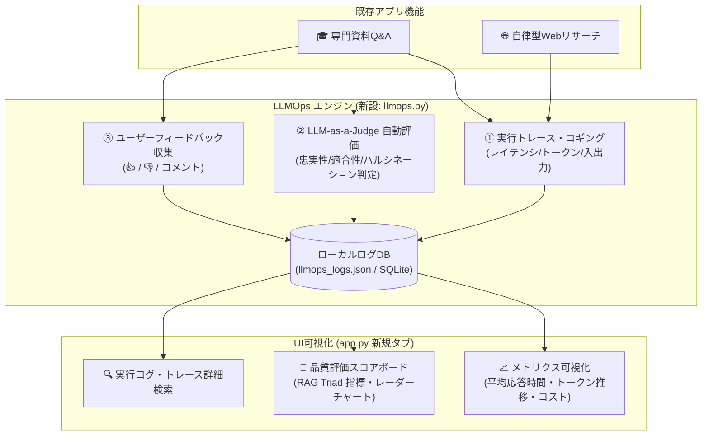

# LLMの可視化と評価 (LLMOps) 実装検討・概要設計書

## 1. 検討結果の結論

**結論：問題なく実装可能です。**

現在稼働している「専門資料Q&A（RAG）」および「自律型Webリサーチ＆レポート生成」の既存機能を**一切削除・変更することなく**、非侵入型（Non-intrusive）のロギング・評価モジュールを新設し、Streamlit UIに新しいタブ「📈 LLMOps & 評価分析」を追加する形で完全統合できます。

---

## 2. 既存機能の保護方針（変更・削除ゼロの保証）

既存のコア機能とLLMOps機能は完全に分離された疎結合アーキテクチャをとります。

| 対象                   | 保護方針                                                                                                                   |
| :--------------------- | :------------------------------------------------------------------------------------------------------------------------- |
| **専門資料Q&A (RAG)**  | 既存のLCELチェーン、FAISS検索、プロンプト、回答フォーマットは100%維持。実行ログはコールバック/ラッパー経由で非同期に記録。 |
| **自律型Webリサーチ**  | ReActループ、DuckDuckGo検索、レポート生成ロジックはそのまま維持。                                                          |
| **資料管理 (PDF/TXT)** | アップロード、削除、PDFプレビュー機能は変更なし。                                                                          |
| **APIキー/設定**       | 既存の `config.py` を共通利用。                                                                                            |

---

## 3. LLMOpsで実装する3大主要機能

本システムに最適化したLLMOps（大規模言語モデル運用・評価）機能として、以下の3つの柱を実装します。



---

### 機能①：実行トレース & パフォーマンス可視化 (Observability & Tracing)

LLMの各呼び出しに関する詳細な実行メタデータを自動記録・可視化します。

- **記録項目**:
  - タイムスタンプ、セッションID、機能種別（RAG Q&A / Webリサーチ）
  - 使用モデル名（`gemini-3.5-flash`, `gpt-4o-mini` など）
  - 応答レイテンシ（処理時間: 秒）
  - プロンプト文字数 / トークン数（推定コスト計算）
  - 検索されたコンテキスト（Chunk数、類似度スコア）
- **可視化ダッシュボード**:
  - 平均応答時間、総リクエスト数、トークン消費量の推移グラフ（折れ線・棒グラフ）
  - モデル別・機能別のパフォーマンス比較表

---

### 機能②：RAG品質の自動評価 (LLM-as-a-Judge)

生成された回答の品質を、評価専用のプロンプト（または小型・高速なLLM）を用いて客観的・定量的にスコアリングします（**RAG Triad** フレームワーク）。

| 評価指標                                      | 測定内容                                                 | 判定基準 (1〜5点)                              |
| :-------------------------------------------- | :------------------------------------------------------- | :--------------------------------------------- |
| **1. 接地性・忠実性 (Faithfulness)**          | 回答が提供されたコンテキスト（講義資料）にどれだけ忠実か | **ハルシネーション（嘘の記述）がないか**を検証 |
| **2. 回答適合性 (Answer Relevance)**          | 回答がユーザーの質問の意図に的確に答えているか           | 質問に対する的確性・網羅性を評価               |
| **3. コンテキスト適合性 (Context Relevance)** | 検索・抽出された資料チャンクが質問に関連しているか       | ベクトル検索（Retriever）の精度を評価          |

- **自動採点モード**:
  - オンライン評価（リアルタイムで各回答に品質スコアを付与）
  - オフラインバッチ評価（事前登録したテスト質問セットを一括評価）

---

### 機能③：ユーザーフィードバック収集 & データセット化 (Human Feedback)

- **フィードバックUI**:
  - 各回答の下に「👍 良い回答」「👎 改善が必要」ボタンとフィードバックコメント欄を設置。
- **データ蓄積 & 活用**:
  - ユーザー評価をログに紐づけて保存。
  - 「低評価（👎）を受けた質問一覧」をダッシュボードで抽出し、資料の不足箇所やプロンプトの弱点を特定・改善に活用。

---

## 4. モジュール構成（ファイル一覧）

```text
Q＆Aボット(RAG)/
├── app.py                     # [改修] UIに「📈 LLMOps & 評価」タブを追加（既存タブはそのまま維持）
├── llmops.py                  # [新規] ロギング、LLM-as-a-Judge評価、メトリクス集計ロジック
├── web_research_agent.py      # [既存維持] 変更なし
├── rag_chain.py               # [既存維持] 変更なし（非侵入型ロギングラッパーを利用）
├── vector_store.py            # [既存維持] 変更なし
├── document_loader.py         # [既存維持] 変更なし
├── config.py                  # [既存維持] 変更なし
├── requirements.txt           # [改修] plotly (グラフ描画用) などを追記
├── data/                      # 講義資料・リサーチレポート格納ディレクトリ
├── logs/                      # [新規] llmops_history.json (実行ログ・評価データ)
└── test_dataset.json          # [新規] ベンチマーク評価用サンプル質問・正解データセット
```

---

## 5. Streamlit UI（新設タブ）の画面構成イメージ

メイン画面に第3のタブを追加します：
`["🎓 専門資料 Q&A", "🌐 自律型 Webリサーチ", "📈 LLMOps & 評価"]`

### 【タブ3】📈 LLMOps & 評価ダッシュボードの構成

1. **📊 サマリーKPIカード (Top Row)**:
   - 総リクエスト数 | 平均レイテンシ（例: 2.1秒） | 平均品質スコア（例: 4.6 / 5.0） | 総推定コスト
2. **📈 パフォーマンス・トレンドグラフ**:
   - 日時別の応答時間推移、トークン使用量、ユーザー評価（👍/👎比率）
3. **🎯 RAG品質評価（LLM-as-a-Judge）分析**:
   - 忠実性・回答適合性・検索適合性のスコア分布（レーダーチャート・棒グラフ）
   - 「ハルシネーションの疑いあり」と判定された回答の警告ハイライト
4. **📋 実行ログ・トレーシング一覧（テーブル & 詳細モーダル）**:
   - 過去のすべての質問・回答・使用モデル・実行時間を一覧表示
   - 任意の行をクリックすると、送信したプロンプト全文や抽出コンテキストを詳細確認可能
5. **🧪 ベンチマーク評価実行（オフラインテスト）**:
   - 「事前定義された10問のテストセットを一括評価」ボタンを設置し、モデルのバージョンアップやプロンプト変更時のリグレッションテストを実行可能

---

## 6. 実装ロードマップ

- **Step 1: 依存ライブラリの追加** (`plotly` などの可視化ライブラリ)
- **Step 2: `llmops.py` の新規作成** (ロガー、評価プロンプト、スコアリング関数、メトリクス集計)
- **Step 3: `app.py` への統合** (各回答へのログ記録トリガー、👍/👎ボタン、第3タブ「📈 LLMOps & 評価」の実装)
- **Step 4: 動作検証** (既存のQ&A・Webリサーチが正常に動作しつつ、ログと評価がダッシュボードに反映されることを確認)
