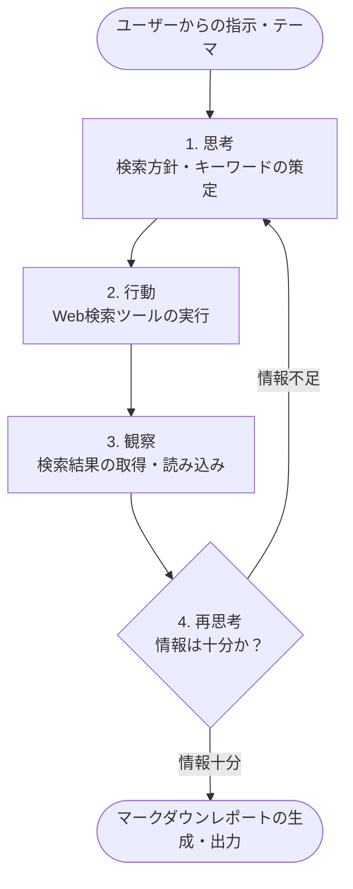

# Webリサーチ＆レポート自動生成エージェント 開発仕様書

## 1. プロジェクト概要・目的

本プロジェクトの目的は、RAGアプリの追加機能として**「Webリサーチ＆レポート自動生成エージェント」** を開発することです。

本エージェントは、ユーザーから与えられたテーマやキーワードに対して**自律的にWeb検索を行い、必要な情報を収集・整理した上で、マークダウン形式のレポートとして出力**します。

---

## 2. 開発の全体像（ReActサイクル）

エージェントは以下の **「思考 (Thought) → 行動 (Action) → 観察 (Observation) → 再思考」** の自律ループによって動作します。



### 各ステップの詳細

1. **思考 (Thought)**: ユーザーの指示に対し、「まず〇〇について検索する必要がある」と検索キーワードや調査方針を決定。
2. **行動 (Action)**: 提供された「Web検索ツール」を呼び出して検索を実行。
3. **観察 (Observation)**: Web検索結果（タイトル・スニペット・URL等）を受け取って内容を把握。
4. **再思考 (Re-Thought / Evaluation)**:
   - 「収集した情報が十分か？」
   - 「足りなければ別のキーワードで再検索するか？」
     を判断し、十分であれば最終レポートの生成フェーズへ進む。

---

## 3. 必要な主要ライブラリ

| ライブラリ名                      | 用途・役割                              | 補足                                                  |
| :-------------------------------- | :-------------------------------------- | :---------------------------------------------------- |
| `langchain`<br>`langchain-openai` | LLMの制御とエージェント構築のコア       | LangChainのエージェントフレームワークおよびモデル連携 |
| `langchain-community`             | 外部ツール（Web検索ツール等）の読み込み | 検索ツールやコミュニティ統合コンポーネントの利用      |
| `duckduckgo-search`               | DuckDuckGo検索API連携                   | APIキー不要で手軽にWeb検索を実行可能                  |

### インストールコマンド例

```bash
pip install langchain langchain-openai langchain-community duckduckgo-search
```
